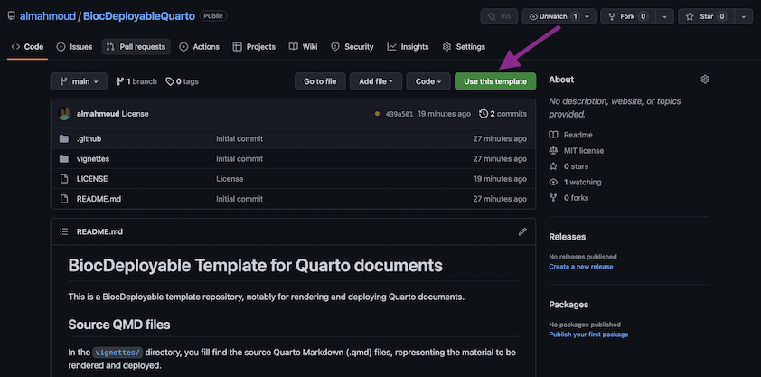
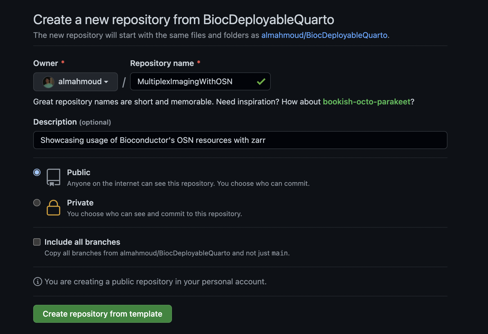

# BiocDeployable Template for Quarto documents

This is a BiocDeployable template repository, notably for rendering and deploying Quarto documents.

## Getting Started

### 0. Background info

#### Source QMD files

In the [`vignettes/`](./vignettes) directory, you fill find the source Quarto Markdown (.qmd) files,
representing the material to be rendered and deployed.

By default, this repository will have an example file containing both R and Python code.
You can start by renaming and editing the example file.
You can add as many qmd files as you want in the `vignettes/` directory, all of which will render all
output formats in the [`autogenerated/quarto` directory](./autogenerated/quarto), as well as build
Docker images with installed dependencies and rendered documents.

#### Dependencies

Some dependencies do not have to explicitly defined, and will be scraped at runtime by [a script](.github/scripts/install_missing.sh)
in the GitHub Action, including:
  - R packages hosted by CRAN (eg: `install.packages("packagename")`)
  - R packages hosted by Bioconductor (eg: `BiocManager::install("packagename")`)
  - Python modules hosted by PyPi (eg: `pip install packagename`)

#### TODO: Additional dependencies declaration

#### GitHub Actions 

This repository notably includes the following GitHub actions:

| Description                                                        | Job Source                                                                       | Outputs                                                                    | Trigger             |
|--------------------------------------------------------------------|----------------------------------------------------------------------------------|----------------------------------------------------------------------------|---------------------|
| Installing dependencies and Rendering Quarto documents             | [quarto_rendering.yaml](./.github/workflows/quarto_rendering.yaml#L6)               | [`autogenerated/quarto` directory](./autogenerated/quarto)                 | Every pushed commit |
| Building Bioconductor RStudio Docker image                         | [docker_build.yaml#buildrstudio](./.github/workflows/quarto_rendering.yaml#L44)       | [`ghcr.io/almahmoud/BiocDeployableQuarto:biocrstudio-main`](https://ghcr.io/almahmoud/BiocDeployableQuarto:biocrstudio-main) docker image | Every pushed commit |
| Building Jupyter Docker image for deployment in Galaxy             | [docker_build.yaml#buildgxyjupyter](./.github/workflows/quarto_rendering.yaml#L74)   | [`ghcr.io/almahmoud/BiocDeployableQuarto:gxyjupyter-main`](https://ghcr.io/almahmoud/BiocDeployableQuarto:gxyjupyter-main) docker image | Every pushed commit |
| Building Bioconductor RStudio Docker image for deployment on AnVIL | [docker_build.yaml#buildanvilrstudio](./.github/workflows/quarto_rendering.yaml#L104) | [`ghcr.io/almahmoud/BiocDeployableQuarto:biocanvil-main`](https://ghcr.io/almahmoud/BiocDeployableQuarto:biocanvil-main) docker image  | Every pushed commit |

#### Outputs

The GitHub actions listed in the table above will generate two kinds of outputs:
  - Documents rendered by Quarto from the source QMD files, which will be pushed by the action in the [`autogenerated/quarto` directory](./autogenerated/quarto) within your GitHub repository.
  - Docker images which will be pushed to the [GitHub Container Registry](https://docs.github.com/en/packages/working-with-a-github-packages-registry/working-with-the-container-registry) with the name of your GitHub repository.

### 1. Forking the repository

You can get started by creating your own repository from this template.

Choose an all lowercase shortname for the repository, and write a brief description
which will serve as your document title. You can rename your repository at a later time in the GitHub settings.

When you fork the repository, an automatic GitHub Action will be dispatched and edit your 
README.md, pointing links to your own repository. You can freely [edit this README file](./README.md) yourself after this initial push.

### 2. Adding your Quarto Markdown documents

The next step is to add your Quarto Markdown documents.